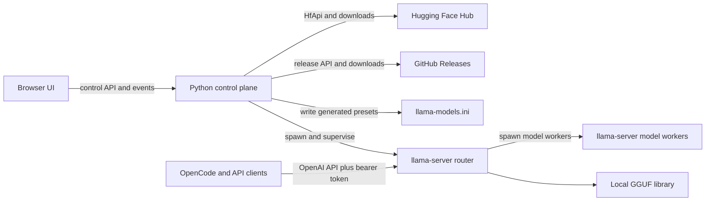

# LlamaWebUI Implementation Plan

**Status:** Proposed, not started  
**Plan date:** 2026-09-19  
**Primary platform:** Windows x64, with portable Linux/macOS support designed in  
**Primary test model:** `unsloth/Qwen3.8-Flash-Next-GGUF`, multi-file `UD-IQ4_XS`

## 1. Goal

Build a portable, local-first web application that makes current llama.cpp releases easy to install, configure, and operate. A user should be able to:

1. Search Hugging Face for GGUF models and compare available quantizations and file sizes.
2. Download, resume, verify, inspect, and delete local model files, including sharded models and multimodal projectors.
3. Install or register multiple llama.cpp runtimes and choose which version/backend to use.
4. Configure simple or advanced per-model launch profiles without losing access to new llama.cpp flags.
5. Start and monitor llama.cpp's native multi-model router and OpenAI-compatible API.
6. Retrieve models through `GET /v1/models` and use them from OpenCode or another OpenAI-compatible client.
7. Create and revoke access tokens for API clients.

The application is a control plane for the official `llama-server` executable. It does not reimplement inference, prompt formatting, model routing, or OpenAI compatibility.

## 2. Confirmed llama.cpp Capabilities

The current upstream server already supplies the required data plane:

- OpenAI-compatible `GET /v1/models`, `POST /v1/chat/completions`, `POST /v1/completions`, `POST /v1/responses`, and `POST /v1/embeddings` endpoints.
- Anthropic-compatible `POST /v1/messages` and token-counting endpoints.
- Router mode when `llama-server` starts without `--model`.
- Model discovery from the llama.cpp cache, `--models-dir`, and `--models-preset`.
- Per-model INI presets using long names, short names, or `LLAMA_ARG_*` names.
- Model load, unload, download, delete, and SSE status APIs under `/models`.
- Native bearer authentication with `--api-key` or `--api-key-file`; the key file supports multiple keys, one per line.
- Model aliases for stable API model IDs.

The supplied Qwen command uses supported `llama-server` options as of the plan date:

| Supplied option | Current canonical option | Planned UI field |
| --- | --- | --- |
| `-m <first-shard>` | `--model` | Model path, selected automatically as shard 1 |
| `--no-reasoning-preserve` | same | Preserve reasoning history toggle, off |
| `-ngl 60` | `--n-gpu-layers 60` | GPU layers, 60 |
| `-c 262144` | `--ctx-size 262144` | Context size, 262,144 |
| `-fa on` | `--flash-attn on` | Flash attention, on |
| `--load-mode none` | same | Load mode, none |
| `-lzm on` | `--lazy-mode on` | Lazy tensor loading, on |
| `--cache-ram 0` | same | Prompt cache RAM, disabled |
| `--fit off` | same | Automatic memory fitting, off |
| `-ot per_layer_token_embd=CPU` | `--override-tensor ...` | Tensor override list |
| `-ctk q4_0` | `--cache-type-k q4_0` | K-cache type, q4_0 |
| `-ctv q4_0` | `--cache-type-v q4_0` | V-cache type, q4_0 |
| `--threads 8` | same | Generation threads, 8 |
| `-b 1024` | `--batch-size 1024` | Logical batch, 1,024 |
| `-ub 1024` | `--ubatch-size 1024` | Physical batch, 1,024 |
| `--host 0.0.0.0` | same | API bind address |
| `--port 1234` | same | API port |

These are startup settings, not runtime HTTP properties. The application must persist them in a model preset and start/restart the managed llama.cpp router with that preset. It must not pretend they can be changed on a loaded process.

## 3. Architecture Decision

Use a small Python control-plane service and a bundled single-page UI. Run llama.cpp as a supervised child process and expose llama.cpp's API directly to clients.



### 3.1 Proposed stack

- **Runtime:** Python 3.12+.
- **Control API:** FastAPI, Pydantic, Uvicorn.
- **Persistence:** SQLite through SQLAlchemy 2 and Alembic migrations.
- **Hub integration:** `huggingface_hub` rather than handwritten Hugging Face URLs.
- **HTTP client:** `httpx` for llama.cpp, GitHub, probes, and tests.
- **Process management:** `asyncio.create_subprocess_exec`; never invoke through a shell.
- **Frontend:** React, TypeScript, Vite, TanStack Query, and a small component layer using Lucide icons.
- **Packaging:** PyInstaller one-folder distribution initially. Bundle the compiled frontend into the Python package and open the browser on launch.
- **Testing:** pytest, pytest-asyncio, Vitest, Testing Library, and Playwright.

One-folder packaging is preferred over a single self-extracting executable because llama.cpp distributions contain several backend DLLs/shared libraries. Keeping each runtime intact in its own directory is more reliable and remains portable as a copied folder.

### 3.2 Port and trust boundaries

- The control UI defaults to `127.0.0.1` on its own port and is not LAN-accessible by default.
- The llama.cpp API bind address and port are configurable independently; the primary profile uses `0.0.0.0:1234`.
- API clients connect directly to llama.cpp, preserving native streaming and endpoint compatibility.
- The control API never accepts arbitrary executable paths or arbitrary command arrays from browser requests. Paths are validated against registered runtimes and model roots.
- Advanced arguments are stored as structured flag/value entries and passed as an argument vector, not concatenated into a command string.

## 4. Versioned llama.cpp Runtime Management

The application must support both official downloaded builds and existing local installations.

### 4.1 Runtime sources

1. **Register existing:** Select a folder or `llama-server[.exe]`; preserve it in place.
2. **Install official build:** Query GitHub Releases and install into `data/runtimes/<release-or-build>/<backend>/`.
3. **Offline portable:** Discover runtimes already copied into the portable data directory.

As of 2026-09-19, upstream stable release `v0.4.1` contains a `nightly-tag.txt` pointer to build `b10964`; the platform binaries live on that build release. Runtime installation must therefore:

1. Resolve a stable tag to its referenced build when needed.
2. Show both identities, for example `v0.4.1 (b10964)`.
3. Enumerate actual assets instead of constructing URLs from assumptions.
4. Offer compatible platform/backend choices such as Windows x64 CPU, CUDA, Vulkan, ROCm, SYCL, and OpenVINO when published.
5. Download companion CUDA runtime DLL assets when the selected release requires them.
6. Verify the GitHub asset `sha256` digest before extraction when a digest is published.
7. Extract into a staging folder, probe it, and atomically promote it only after success.

### 4.2 Runtime capability probe

Every registered runtime is probed with:

- `llama-server --version`
- `llama-server --help`
- `llama-server --list-devices`, with a timeout and captured output

Store the executable path, reported version/build/commit, backend asset, devices, raw help text hash, parsed option catalog, and probe result. Re-probe whenever the executable changes.

The parsed option catalog drives the profile editor. Known options receive typed controls and help text. Newly introduced options remain usable through an advanced argument editor. Before launch, reject only options that the selected executable does not advertise; provide a clear compatibility error and preserve the profile.

### 4.3 Upgrade and rollback

- Installing a runtime never overwrites another version.
- A server profile pins a runtime ID; changing it is explicit.
- Show release notes links and whether the installed runtime is current.
- Validate all affected model profiles against a candidate runtime before switching.
- Stop the router before removing an in-use runtime.
- Keep the previous runtime available for one-click rollback.

## 5. Hugging Face Discovery and Downloads

### 5.1 Search experience

Use `HfApi.list_models(filter="gguf", search=..., sort=..., limit=...)`. The page should support:

- Debounced text search by model/repository name.
- Sort by relevance, trending, downloads, likes, and last modified where the Hub API supports it.
- Filters for author, parameter range, architecture/base model, language, license, and gated/private visibility.
- Compact result rows showing repository, description, parameter count, downloads, likes, updated date, tags, and gated status.
- Pagination/infinite loading with cancellation and short-lived response caching.
- A Hugging Face token setting for gated/private repositories, stored as a secret and never returned to the browser after entry.

### 5.2 Repository detail and quant grouping

On selection, fetch full repository metadata and siblings. Build a file manifest and group `.gguf` files into logical downloads:

- Detect quant names case-insensitively from standard filename patterns, while preserving unknown names.
- Group sharded files using `-00001-of-000NN` and require a complete contiguous shard set.
- Associate `mmproj*.gguf` files with the text model and mark them optional/required based on repository metadata where possible.
- Distinguish model files, projectors, LoRA files, and unrelated artifacts.
- Display total group size, shard count, individual files, last modified/revision, and quant family.
- Pin downloads to the selected repository revision/commit SHA for reproducibility.
- Warn rather than guess when filenames are ambiguous; allow manual group selection.

Filename parsing is a convenience, not the source of truth. After download, use a bundled or selected runtime's metadata tool where available, or a small read-only GGUF metadata parser, to confirm architecture, quantization, context metadata, parameter count, and shard metadata.

### 5.3 Download manager

Use `huggingface_hub` for authenticated, cached, revision-pinned transfers and implement a durable application job layer around it:

- Queue multiple model groups and limit concurrent files/downloads.
- Stream aggregate and per-file progress to the UI through server-sent events or WebSocket events.
- Pause by cancelling the active transfer while retaining partial data; resume using Hub cache semantics and HTTP range support.
- Retry transient failures with bounded exponential backoff.
- Check free disk space before starting and periodically during large downloads.
- Download to temporary/partial paths and expose a model only after all required shards complete.
- Verify available ETags/checksums and final byte sizes.
- Support cancellation, retry, reveal-in-folder, and safe deletion.
- Reconcile interrupted jobs and orphaned partials on startup.

Use an application-owned model root by default, but allow additional read-only or managed roots, including an existing LM Studio model folder. Never delete files outside a managed root without an explicit confirmation showing the exact paths.

## 6. Local Model Library

The library merges three sources:

1. Models downloaded by this application.
2. Models scanned from configured directories.
3. Models reported by the active llama.cpp router/cache.

For each logical model, store or derive:

- Stable internal UUID and user-facing API alias.
- Hugging Face repository/revision when known.
- Primary GGUF path and complete shard list.
- Quantization, size, architecture, parameter count, training context, modalities, and projector path.
- Validation state: valid, incomplete, missing, modified, or unsupported by selected runtime.
- Associated launch profiles and current router state.

Directory scanning must be asynchronous, cancellable, and incremental. Key files by canonical path plus size/modification time, then perform expensive metadata reads only when those values change.

## 7. Model Profiles and Advanced Configuration

### 7.1 Profile model

A profile binds:

- A stable model alias used by `/v1/models` and client requests.
- One logical local model and optional mmproj/draft model/LoRA files.
- One pinned llama.cpp runtime.
- Typed settings grouped into Model, Context, CPU, GPU/offload, KV cache, batching, reasoning/chat, speculative decoding, multimodal, and lifecycle sections.
- Additional advanced arguments for flags not yet represented by typed controls.
- Optional notes and tags.

Profiles support clone, rename, import command, export command, reset to runtime defaults, and dry-run validation.

### 7.2 Command import/export

Provide a Windows/POSIX command importer specifically to ease migration from scripts. It should tokenize without executing, recognize the selected runtime's aliases, populate typed fields, and retain unrecognized arguments in the advanced list. Export produces a readable command for debugging, but process launch always uses the structured argument vector.

### 7.3 Generated llama.cpp preset

Generate a versioned INI file from enabled profiles and start router mode with `--models-preset <generated-file>`. Write to a temporary file, parse/validate, then atomically replace the active preset.

Illustrative primary-test section:

```ini
version = 1

[qwen3.8-flash-next-ud-iq4-xs]
model = C:\Users\nickp\.lmstudio\models\unsloth\Qwen3.8-Flash-Next-GGUF\Qwen3.8-Flash-Next-UD-IQ4_XS-00001-of-00003.gguf
no-reasoning-preserve = true
n-gpu-layers = 60
ctx-size = 262144
flash-attn = on
load-mode = none
lazy-mode = on
cache-ram = 0
fit = off
override-tensor = per_layer_token_embd=CPU
cache-type-k = q4_0
cache-type-v = q4_0
threads = 8
batch-size = 1024
ubatch-size = 1024
```

Host, port, API-key file, model limit, and other router-owned settings belong to the server configuration, not individual model sections. The UI must explain this distinction.

### 7.4 Validation before start/load

- Confirm runtime capability for every configured option.
- Confirm all model shards and auxiliary files exist and are readable.
- Reject duplicate aliases and reserved/unsafe alias forms.
- Check port availability and warn about `0.0.0.0` without authentication.
- Run a short-lived preset validation/startup probe where the runtime supports no-load validation; otherwise capture an immediate startup failure and retain full logs.
- Display the exact sanitized argument vector and generated preset before applying advanced changes.

## 8. Server Lifecycle and Monitoring

### 8.1 Supervision

The Python service owns one active router process in the first release:

- Start automatically on application launch only when the setting is enabled.
- Use a new process group so shutdown can terminate the router and descendants cleanly on Windows and POSIX.
- Capture stdout/stderr continuously into rotating files and an in-memory tail.
- Parse JSONL logs when the selected runtime supports `--log-jsonl`; retain plain-text compatibility.
- Poll `/health` and `/models`, and subscribe to `/models/sse` for model/download/load state.
- Distinguish stopped, starting, ready, degraded, stopping, crashed, and externally occupied port states.
- Apply bounded restart-on-crash policy and stop retrying after repeated rapid failures.
- On application shutdown, request graceful termination, wait, then force only the owned process tree if necessary.
- Never kill an unrelated process merely because it occupies the configured port.

### 8.2 Operations UI

The main dashboard is an operational workspace, not a landing page. It includes:

- Persistent left navigation: Dashboard, Models, Discover, Downloads, Server, Profiles, Access, Runtimes, Settings.
- Top status strip for router state, endpoint, active runtime, loaded model count, and current throughput/activity.
- Dashboard is the primary operational summary: CPU, RAM, network, disk I/O, and—when available—GPU/VRAM utilization and memory. Metrics must show unavailable/unsupported states clearly rather than inventing values.
- Model table with quant, size, profile, loaded/loading/sleeping/error state, and load/unload actions.
- Server page with start/stop/restart, endpoint copy action, health, selected profile details, effective runtime and launch arguments, log stream, and recent failures.
- Server monitoring shows current and peak tokens per second, prompt-processing throughput, decode throughput, active task number, current-task elapsed time, and context usage when those values are available from llama.cpp timing/status output.
- Server log presentation is newest-first with a bounded tail; users should not need to scroll through the entire retained log to see the latest output. Raw chronological logs remain available for diagnostics/export.
- Timing lines such as `prompt processing`, `n_gen`, `tg`, `tg_3s`, and task identifiers are parsed into structured monitoring samples instead of being displayed only as unstructured text.
- Profile editor with Basic and Advanced tabs, inline capability validation, and an unsaved-change guard.
- Download drawer that remains visible across navigation.
- Responsive layouts usable on a laptop and phone without hiding critical state or actions.

Destructive operations require confirmation. Loading and stopping states disable conflicting actions and show progress without shifting the surrounding layout.

## 9. API Access Tokens

Use llama.cpp's native `--api-key-file` to preserve direct endpoint behavior.

### 9.1 Token workflow

- Create a cryptographically random token and show it exactly once.
- Give each token a local display name, creation date, optional expiry note, last-four-character hint, and enabled state.
- Store token metadata and a keyed hash in SQLite.
- Materialize enabled plaintext tokens only in a restricted-permission runtime key file because llama.cpp must read the actual values.
- Never write tokens into command-line arguments, logs, exported diagnostics, or frontend persistence.
- Revoke/enable by rewriting the key file atomically and performing a controlled router restart after explicit confirmation.
- Offer copyable client setup using the newly created token while it is still visible.

### 9.2 Native limitation

Current llama.cpp treats all keys as equivalent and does not expose per-key scopes, quotas, identity, usage, or documented hot reload. Therefore the first release provides named administration and revocation but not authorization scopes or interruption-free key changes.

If future requirements include per-client rate limits, model allowlists, audit attribution, or instant revocation, add an optional authenticated streaming reverse proxy as a separate phase. Do not put that proxy in the initial request path because it increases compatibility and reliability risk.

### 9.3 Control-plane security

- Default the UI/control API to localhost.
- Use a random local session secret and same-origin cookies with CSRF protection for mutating requests.
- Require an admin password before allowing non-loopback control-plane binding.
- Store the Hugging Face token and other control-plane secrets using Windows Credential Manager/macOS Keychain/Linux Secret Service when available, with an explicitly acknowledged encrypted-file fallback for portable mode.
- Redact bearer tokens, HF tokens, query secrets, and sensitive environment values from logs and diagnostics.
- Recommend TLS/reverse proxy for any API exposed beyond a trusted LAN; llama.cpp's native TLS fields may be configured when the runtime supports them.

## 10. Client Integration

### 10.1 OpenCode helper

Provide a generated snippet and copy/download actions, not direct modification of user configuration. A representative configuration is:

```jsonc
{
  "$schema": "https://opencode.ai/config.json",
  "provider": {
    "llama-web-ui": {
      "npm": "@ai-sdk/openai-compatible",
      "name": "Local llama.cpp",
      "options": {
        "baseURL": "http://127.0.0.1:1234/v1",
        "apiKey": "{env:LLAMA_WEB_UI_API_KEY}"
      },
      "models": {
        "qwen3.8-flash-next-ud-iq4-xs": {
          "name": "Qwen 3.8 Flash Next UD-IQ4_XS",
          "limit": {
            "context": 262144,
            "output": 65536
          }
        }
      }
    }
  }
}
```

The model key must exactly match an ID returned by `GET /v1/models`. The UI should query that endpoint and generate configuration from the live result rather than relying only on stored aliases.

### 10.2 Connection tester

Add a client-oriented test panel that:

1. Calls `/health`.
2. Calls authenticated `/v1/models` and displays IDs.
3. Sends a small non-streaming chat completion.
4. Sends a streaming chat completion and verifies termination.
5. Optionally sends a simple tool definition and verifies a parseable tool call for models expected to support tools.
6. Shows equivalent curl, Python OpenAI SDK, and OpenCode settings with secrets redacted by default.

## 11. Control API Shape

Keep the control API separate from llama.cpp's API. Initial resource groups:

- `/api/status` and `/api/events`
- `/api/settings`
- `/api/runtimes`, `/api/runtimes/releases`, and runtime probe/install/remove operations
- `/api/huggingface/search`, `/api/huggingface/models/{repo}`
- `/api/downloads` and pause/resume/cancel/retry operations
- `/api/library` and scan/inspect/delete operations
- `/api/profiles` and validate/import/export operations
- `/api/server` and start/stop/restart/log operations
- `/api/tokens` for create/list/revoke, never read-back
- `/api/client-configs/opencode` and `/api/connection-test`

Long operations return job IDs immediately. State changes are serialized through service-level locks, persisted before execution, and published over one event channel with monotonically increasing event IDs so the frontend can reconnect and reconcile.

## 12. Persistence and Filesystem Layout

Portable mode stores all application-owned data beside the executable; installed mode uses the platform application-data directory.

```text
LlamaWebUI/
  LlamaWebUI.exe
  data/
    app.db
    settings.json
    models/
    runtimes/
      b10964/
        win-cuda-13.3-x64/
    generated/
      llama-models.ini
      api-keys.txt
    cache/
      huggingface/
      github/
    downloads/
    logs/
```

SQLite entities should include `Runtime`, `ModelArtifact`, `ModelFile`, `ModelProfile`, `DownloadJob`, `AccessToken`, `ServerRun`, and `Setting`. Secrets are referenced by credential-store IDs rather than stored directly where platform facilities are available.

Use schema migrations from the first release. Use atomic file replacement for settings, presets, and key files. Back up the database before a migration and retain a bounded number of backups.

## 13. Delivery Phases

### Phase 0: Feasibility spikes

- [ ] Probe the user's current `llama-server.exe` and a downloaded current release.
- [ ] Prove the exact Qwen command starts successfully from a generated router preset.
- [ ] Confirm all three Qwen shards are found when the first shard is configured.
- [ ] Verify router `GET /v1/models`, load/unload, SSE, chat streaming, reasoning behavior, and tool calls.
- [ ] Confirm whether changing `--api-key-file` requires restart for the selected runtime.
- [ ] Test shutdown of router child workers on Windows.
- [ ] Record capability differences between at least one older build and the current build.

**Gate:** Do not build the full UI until the primary profile works through router mode and returns the expected alias from `/v1/models`.

### Phase 1: Application foundation

- [ ] Create Python package, FastAPI service, SQLite schema/migrations, structured settings, frontend shell, and event channel.
- [ ] Implement portable/installed data-directory selection and single-instance locking.
- [ ] Add redacted structured logging and diagnostics bundle generation.
- [ ] Package and launch a static frontend from the Python service.

**Gate:** A packaged app starts from a copied folder, opens the UI, persists settings, and shuts down cleanly.

### Phase 2: Runtime manager

- [ ] Register and probe existing llama.cpp folders.
- [ ] Query releases, resolve stable-to-build pointers, list platform assets, download, verify, stage, and install.
- [ ] Parse runtime options/devices and expose capability diagnostics.
- [ ] Add pin/switch/remove/rollback flows.

**Gate:** Install or register two versions side by side and validate a profile differently against each version.

### Phase 3: Local library and profiles

- [ ] Scan managed and external model directories.
- [ ] Detect complete sharded GGUF groups and read metadata.
- [ ] Implement aliases, profile CRUD, command import/export, typed controls, advanced flags, and generated presets.
- [ ] Add the exact Qwen primary profile as an end-to-end fixture, using configurable paths rather than committing a machine-specific path.

**Gate:** Import the supplied command, produce an equivalent preset, and round-trip it without losing any option.

### Phase 4: Server lifecycle

- [ ] Implement owned process supervision, logs, health checks, event synchronization, graceful stop, crash policy, and startup setting.
- [ ] Implement model load/unload and live status through the native router API.
- [ ] Add port ownership checks and safe failure handling.

**Gate:** Repeatedly start, load, infer, unload, restart, and stop without orphaned workers or an occupied port.

### Phase 5: Hugging Face browser and downloads

- [ ] Implement GGUF-only search, filters, sorting, repository detail, quant grouping, and gated-repo authentication.
- [ ] Implement durable, resumable download jobs and UI progress.
- [ ] Reconcile completed downloads into the local library and router preset.
- [ ] Add safe cancellation and deletion.

**Gate:** Search for the primary Qwen repository, select `UD-IQ4_XS`, download all shards, interrupt/resume once, verify, and make it loadable.

### Phase 6: Tokens and client onboarding

- [ ] Implement native key-file generation and named token metadata.
- [ ] Add create/show-once/revoke/restart flow and file-permission checks.
- [ ] Generate live OpenCode/curl/OpenAI SDK configurations.
- [ ] Add authenticated model-list and completion connection tests.

**Gate:** One valid client token succeeds, a random token fails with 401, and a revoked token fails after the confirmed restart.

### Phase 7: Hardening and release

- [ ] Complete Windows x64 CPU/CUDA/Vulkan matrix and portable-package tests.
- [ ] Smoke-test Linux x64 and macOS arm64 if release targets include them.
- [ ] Add update checks for the application without silently replacing llama.cpp runtimes.
- [ ] Finish accessibility, responsive layout, error recovery, backup/restore, and offline behavior.
- [ ] Write operator documentation and a troubleshooting guide based on real failure output.

**Gate:** A clean Windows machine can unzip, launch, install/register llama.cpp, discover/download or register the Qwen model, serve it, and connect from OpenCode without developer tools.

## 14. Test Strategy

### 14.1 Unit tests

- Unit tests are required for every domain rule, parser, state machine, validator, and security-sensitive helper. Business logic must remain outside framework handlers so it can be tested without HTTP, subprocesses, the filesystem, or a live database.
- Runtime help/version parsing across captured outputs from multiple old and current builds, including malformed, localized, missing, renamed, and duplicated options.
- GitHub asset selection and stable-to-build pointer resolution across platforms, architectures, backends, missing companion assets, and unavailable digests.
- GGUF quant and shard grouping, including malformed names, mixed-case quants, ambiguous files, missing/duplicate shards, mmproj association, and unknown future quant names.
- Windows and POSIX command tokenization/import, argument aliases, boolean negation, repeated flags, quoting, paths with spaces, shell metacharacters, and lossless import/export round-tripping.
- Preset generation and parsing, escaping, ordering, duplicate/reserved aliases, runtime-owned option filtering, unsupported flags, and atomic replacement decisions.
- Profile validation for field ranges, conflicting options, missing files, runtime compatibility, model aliases, bind addresses, and unauthenticated network exposure warnings.
- Download state-machine transitions for queue, start, progress, pause, resume, retry, cancel, completion, verification failure, disk-full failure, and interrupted-process recovery.
- Server lifecycle state-machine transitions for start, readiness, timeout, stop, crash, bounded restart, port collision, and stale process events.
- Event sequencing, replay cursors, deduplication, stale-event rejection, progress aggregation, and frontend query-cache reconciliation.
- Token generation, hashing, constant-time comparison, expiry/enable rules, show-once behavior, key-file rendering, secret redaction, and permission-selection logic.
- Canonical path validation, managed-root containment, traversal and symlink/junction edge cases, deletion eligibility, and portable-path resolution.
- SQLite model mapping, settings defaults/overrides, migration transforms, backup selection, and startup reconciliation logic using isolated in-memory or temporary databases.
- Frontend unit tests for stores, hooks, formatters, reducers, validation, error mapping, form serialization, disabled/loading states, and accessibility behavior of interactive controls.
- Deterministic property-based tests for command round-tripping, shard grouping, path containment, event ordering, and state-machine invariants.
- Regression tests accompany every defect fix and must fail against the unfixed behavior.

### 14.2 Integration tests

- Fake Hugging Face/GitHub HTTP servers for pagination, auth, range resume, rate limits, digest failures, and disappearing assets.
- A fake `llama-server` executable for process, crash, timeout, logs, and version-compatibility tests.
- Real small GGUF smoke tests in CI for `/health`, `/v1/models`, non-streaming, and streaming requests.
- SQLite migrations and backup/restore.
- Windows process-tree termination.

### 14.3 End-to-end tests

- Search -> quant selection -> download -> profile -> start -> load -> authenticated inference.
- Register existing LM Studio directory -> detect sharded model -> create primary Qwen profile.
- Install two llama.cpp versions -> switch -> detect an unsupported/renamed option without corrupting the profile.
- Create token -> use from OpenCode-compatible request -> revoke -> restart -> reject.
- Browser tests at desktop and mobile sizes with screenshot checks for overflow and overlapping controls.

### 14.4 Unit coverage and quality gates

- Measure Python coverage with `pytest-cov`/coverage.py and frontend coverage with Vitest's V8 provider; publish line, branch, function, and uncovered-line reports in CI.
- Require at least 90% line coverage and 85% branch coverage for both Python and TypeScript application logic. Generated code, migration boilerplate, and purely declarative styling may be excluded only through reviewed coverage configuration.
- Require 100% branch coverage for security and correctness-critical pure logic: token validation/redaction, path containment, command argument generation, preset serialization, shard completeness, and lifecycle/download transition guards.
- Enforce thresholds per package/module as well as globally so a well-tested utility cannot hide an untested subsystem.
- Run the complete unit suite on every pull request and block merging on failures, coverage regression, reduced thresholds, newly uncovered changed lines, or skipped tests without an explicit tracked justification.
- Unit tests must be isolated, deterministic, order-independent, parallel-safe, and free of real network access, user files, fixed ports, clock dependence, and installed llama.cpp requirements. Inject clocks, randomness, filesystem adapters, HTTP clients, and process adapters.
- Keep the normal unit suite fast enough for routine local execution, targeting under 30 seconds on the primary development machine; mark genuinely slower tests as integration tests rather than weakening isolation.
- Do not silently quarantine flaky tests. Retain failing random seeds and require an owner plus tracked issue for any temporary skip.
- Run targeted mutation testing periodically on token validation, path restrictions, argument/preset generation, and state machines to prove assertions detect incorrect behavior rather than merely execute lines.
- Release candidates require zero unexpected unit-test retries or skips and must pass the full unit suite from a clean checkout on every advertised platform.

### 14.5 Primary acceptance test

On the user's target machine, the generated profile must be behaviorally equivalent to:

```bat
@echo off
cd /d "C:\llama-tools"
llama-server.exe -m "C:\Users\nickp\.lmstudio\models\unsloth\Qwen3.8-Flash-Next-GGUF\Qwen3.8-Flash-Next-UD-IQ4_XS-00001-of-00003.gguf" --no-reasoning-preserve -ngl 60 -c 262144 -fa on --load-mode none -lzm on --cache-ram 0 --fit off -ot per_layer_token_embd=CPU -ctk q4_0 -ctv q4_0 --threads 8 -b 1024 -ub 1024 --host 0.0.0.0 --port 1234
```

Pass conditions:

- The router reaches healthy state and reports the configured alias through authenticated `GET /v1/models`.
- All three model shards are used without manually listing shards 2 and 3.
- Runtime logs confirm the requested 262,144 context, GPU layer count, cache types, load/lazy/fit choices, CPU tensor override, threads, and batch sizes.
- A streaming OpenAI-compatible request completes through OpenCode using a configured token.
- Reasoning is not preserved in history, matching `--no-reasoning-preserve`.
- Restarting the application restores the selected runtime, profile, token configuration, and optional auto-start behavior.

## 15. Risks and Mitigations

| Risk | Mitigation |
| --- | --- |
| llama.cpp flags and APIs change frequently | Probe each executable; generate controls from capabilities; pin profiles; preserve unknown advanced args; test multiple versions. |
| Stable releases and binary build tags differ | Resolve release metadata and assets dynamically; display both IDs; verify published digests. |
| Router mode is newer than some desired versions | Capability-detect it; mark unsupported versions as single-model-only or require a newer runtime for managed multi-model mode. |
| Quant names and shard layouts are inconsistent | Treat filename parsing as heuristic; show manifests; validate completeness and GGUF metadata. |
| Huge contexts exhaust RAM/VRAM or take a long time to load | Show estimates/warnings, stream startup logs, retain explicit user values, and never silently enable `--fit`. |
| Windows termination leaves model workers alive | Use process groups/job-object support and integration-test full tree cleanup. |
| API key changes interrupt clients | State the native limitation, require restart confirmation, and defer a dynamic auth proxy until needed. |
| Binding to all interfaces exposes powerful APIs | Require keys, warn prominently, keep control UI local, support TLS/reverse-proxy guidance, and redact secrets. |
| Portable secret storage is weaker | Prefer OS credential stores; clearly label and permission the fallback; never store secrets in frontend storage. |
| Upstream download APIs or rate limits fail | Cache metadata briefly, honor rate limits, retry with backoff, support HF/GitHub tokens, and keep local operation fully offline-capable. |

## 16. Initial Scope Boundaries

Included in the first complete release:

- One managed llama.cpp router process.
- Multiple model profiles and llama.cpp's native model routing/autoload.
- Hugging Face GGUF discovery and downloads.
- Existing local/LM Studio directories.
- Versioned official and user-supplied llama.cpp runtimes.
- Native OpenAI/Anthropic endpoints and native API keys.
- OpenCode setup assistance and connection tests.

Deferred unless a feasibility spike makes it necessary:

- A custom inference/auth reverse proxy.
- Per-client quotas, model scopes, billing, or detailed audit accounting.
- Remote machine/cluster orchestration.
- Model conversion or quantization.
- Training/fine-tuning workflows.
- A general chat client duplicating llama.cpp's own chat UI.
- Docker/Kubernetes deployment as the primary portable format.

## 17. Decisions to Confirm Before Implementation

The plan can proceed with the defaults below, but these decisions affect packaging or security:

1. **Initial OS support:** Windows x64 first, while keeping paths/process abstractions portable; add packaged Linux/macOS after the Windows acceptance test.
2. **Runtime source:** Support both registering `C:\llama-tools` and downloading official builds; never require the app to own llama.cpp.
3. **Token semantics:** Native equivalent bearer keys with restart-on-change are sufficient initially; scoped or zero-downtime tokens are deferred.
4. **Model storage:** Use an application model directory by default and register the existing LM Studio directory without moving it.
5. **Startup behavior:** Make router auto-start opt-in per installation, remembering the last healthy configuration.
6. **Control UI exposure:** Keep it localhost-only by default even when the inference endpoint binds to `0.0.0.0`.

## 18. References Checked

- llama.cpp server README and current master options: <https://github.com/ggml-org/llama.cpp/blob/master/tools/server/README.md>
- Current llama.cpp release metadata: <https://github.com/ggml-org/llama.cpp/releases/latest>
- Hugging Face Hub search API: <https://huggingface.co/docs/huggingface_hub/guides/search>
- Hugging Face GGUF support: <https://huggingface.co/docs/hub/gguf>
- OpenCode llama.cpp provider configuration: <https://opencode.ai/docs/providers/#llama.cpp>

References are evidence for this plan, not fixed contracts. Implementation must probe the installed runtime and handle upstream API/version changes explicitly.